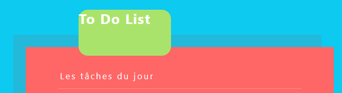
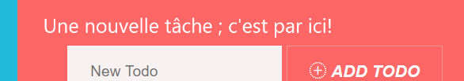
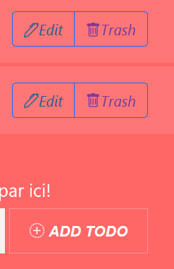
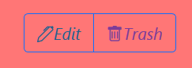
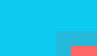

# DFS_Front_E4_Diallo_Faure_Projet2


Application type ToDo List.
Choix fait de repartir du code initial repris de l'application transmise en cours.

* Animations de types CSS avec librairie React :  [FRAMER MOTION](https://www.framer.com/)
* Intégration d'un framework : [BOOSTRAP](https://getbootstrap.com/) 

---
## Getting Started

This project was bootstrapped with [Create React App](https://github.com/facebook/create-react-app).

### Prerequisites

Things you need to install the software and how to install

```
$ npm install
$ npm start
```
---
## FONCTIONNALITES
---
### Titre de l'application  
  
:arrow_forward: TodoList.js
```
        <h1 className="example-container">
          <motion.div
            style={{
              fontWeight: "bold",
              width: 300,
              height: 150,
              borderRadius: 30,
              position: "absolute",
            }}
            animate={{
              left: "20%",
              top: -10,
              scale: 0.5,
              rotate: 360,
              backgroundColor: "#ff9999",
            }}
          >
            To Do List
          </motion.div>
          <span>Les tâches du jour</span>
        </h1>
```
- Interaction utilisateur
> A l'ouverture de l'application, le titre de l'application est mis en évidence.

- Type d'animations CSS utilisée
> Framer Motion --> animate  
> Besoin de :  
```import { motion, MotionConfig } from "framer-motion"```

- Explication de l'implémentation
> La partie \<h1> fait un tour sur lui-même (360°), à une échelle de 1/2 en décalant son emplacement (par rapport à l'emplacement initial du titre) vers le bas de -10 (donc vers le haut!) et celui de gauche de 20%.  
> Alors que le sous-titre (\<span>) ne subit pas l'animation.  
---
### Label d'un New To Do 
  
:arrow_forward: TodoForm.js
```
      <motion.div
        animate={{ scale: 1.2 }}
        transition={{
          type: "spring",
          damping: 3,
          repeat: Infinity,
          repeatDelay: 2,
        }}
      >
        <label htmlFor="task">Une nouvelle tâche ; c'est par ici!</label>
      </motion.div>
```
- Interaction utilisateur
> Attirer l'utilisateur pour la fonctionnalité d'ajout de tâche à réaliser

- Type d'animations CSS utilisée
> Framer Motion --> animate  
> Besoin de :  
```import { motion } from "framer-motion"```

- Explication de l'implémentation
> \<Label> passant d'une taille de 1 à 1.2, l'animation est de type "Spring" et elle réalise un amortissement en 3 rebonds avant de se répéter en boucle (repeat) afin de permettre à l'animation d'être présente en permanence.
---
### Icons de l'application  
  
:arrow_forward: Todo.js et TodoForm.js

```
    <i class="bi bi-pen" style={{ color: "#1F618D" }}>Edit
    </i>
    ---
    <i
        id={todo.id}
        className="bi bi-trash"
        style={{ color: "#7D3C98" }}
    >Trash</i>
    ---
    <i class="bi bi-plus-circle-dotted"> Add Todo</i>

```  

- Interaction utilisateur
> Doubler l'affichage texte avec un icon associé

- Intégration framework utilisé
> Bootstrap --> icon  
> Besoin de :  
```import "bootstrap-icons/font/bootstrap-icons.css"```  
```import "bootstrap/dist/css/bootstrap.min.css"```  


- Explication de l'implémentation
> ajout de la class de l'icon choisi à l'intérieur du \<button> avec style appliqué pour la couleur.
> Le bouton trash a intégré le param {todo.id} permettant de remettre à jour la liste des ToDo.  
---
### Boutons Edit/Trash en groupe  
  
:arrow_forward: Todo.js

```
<div class="btn-group" role="group" aria-label="Basic example">
          <button
            onClick={toggleFrom}
            type="button"
            class="btn btn-outline-primary"
          >
            <i class="bi bi-pen" style={{ color: "#1F618D" }}>
              Edit
            </i>
          </button>
          <button
            onClick={handleClick}
            type="button"
            class="btn btn-outline-primary"
          >
            <i
              id={todo.id}
              className="bi bi-trash"
              style={{ color: "#7D3C98" }}
            >
              Trash
            </i>
          </button>
        </div>
```  

- Interaction utilisateur
> Présenter un groupe de boutons relatif aux actions possibles pour une tâche.

- Intégration framework utilisé
> Bootstrap --> button  
> Besoin de :  
```import "bootstrap-icons/font/bootstrap-icons.css"``` 

- Explication de l'implémentation
> Bouton de type "group" permettant de rassembler plusieurs boutons (ici Edit et Trash)  

---
### Fond de couleur  
  
:arrow_forward: index.js

```
    <div class="p-3 mb-2 bg-info">
      <TodoList />
    </div>
```  

- Interaction utilisateur
> Aucune : utilisation du framework Boostrap

- Intégration framework utilisé
> Bootstrap --> background  
> Besoin de :  
```import "bootstrap/dist/css/bootstrap.min.css"``` 

- Explication de l'implémentation
> Intégration d'un fond de couleur pré-déterminé par Bootstrap sur le bloc list.
---
## Running the tests

Not Available


## Authors

- **DIALLO Thierno - E4 - ESTIAM**
- **FAURE Alice - E4 - ESTIAM** 

## License

Not Available
